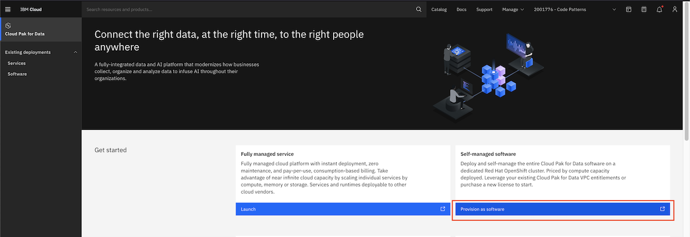

### Create DB2, Watson Knowledge Studio and Watson Query on the self managed software mode for Cloud Pak for Data service

Login to IBM Cloud. Go to https://cloud.ibm.com/cloudpaks/data/overview.

Click on `Provision as software`.

Please ensure that options to install  DB2, Watson Knowledge Studio and Watson Query are selected. After configuring all the pre-requisite details, click `Install`.

For more details on the installation process refer this [link](https://www.ibm.com/docs/en/cloud-paks/cp-data/4.0?topic=installing).
