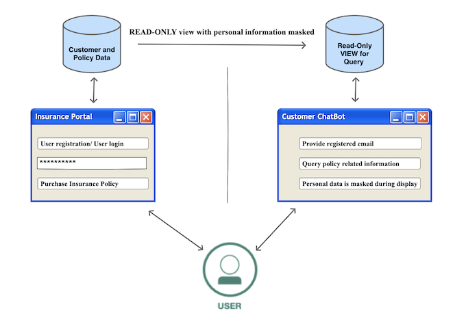

# Work in progress

# Create a read-only view of data for AI applications with sensitive information masked 

In any business there is lot of sensitive information collected like date of birth, credit card number, mobile number etc. This data is stored in databases. A data governance framework must be in place to enforce the privacy and allowed use of such information.

There are many scenarios where such sensitive information is needed by other business applications. Few examples are listed here:
- In a customer support application where customer orders are being queried - the mobile number, credit card number or address must be partially masked with maybe last 4 characters displayed.
- A machine learning application needs to perform an analysis based on sensitive information like credit card number. In such cases, the machine learning application needs to be provided obfuscated data for analysis and model building.

This code pattern demonstrates a methodology to provide a read-only view of data with senstive information masked for an application. 

For this purpose, an insurance business scenario has been taken. There are two applications provided:
- An insurance portal application
- A chatbot application



A customer registers on the insurance portal. During registration, the customer provides mobile number, address and e-mail. After registration, the customer can login and purchase insurance policies. The customer supplies credit card details for purchasing the policy. 
After an insurance policy has been purchased, a customer can query policy details with next premium due information on the chatbot. The user will be able to query this information without logging in. This requires sensitive information in the policy to be masked win the display. In this code pattern, the first 12 digits of the credit card used to purchase the policy will be masked and the last 4 digits will be displayed in addition to other details in the chatbot application.

The `Insurance Portal Application` owns the policy data. The `Chatbot Application` will have a read-only access of the data with `data protection policies` applied on the data specified in the `Data Governance` framework.

In this code pattern, you will learn how to:
- Set up data assets for governance in the Watson Knowledge Catalog
- Create data categories, classes, business terms and data protection rules for the data assets
- Create virtualized view of the data on Watson Query with data policies enforced
- Create a chatbot aapplication using Watson Assistant that consumes the read-only data with sensitive information masked from Watson Query

Security Verify has been used to implement authentication for the insurance application.


## Flow

1. Create tables in Db2. The Db2 connection and the tables(as `Data Asset`) are added to the `Watson Knowledge Catalog(WKC)`. The data policies are configured for the data assets in `WKC`.
2. Db2 is added as a data source in Watson Query. The needed tables are virtualized and a `View` is created by joining the virtualized tables. 
3. The Watson Query virtualized tables and view are published to `WKC`. The data policies are configured for the data assets in `WKC`.
4. User registers on the `Insurance Portal`. This creates an user profile on `Security Verify`. User logs into the `Insurance Portal` with the newly created credentials. 
5. The credentials are validated by `Security Verify` and request is re-directed to the application.
6. User purchases an `Insurance Policy`. The policy information is stored in the `Db2` database.
7. User accesses the chatbot on the `Insurance Portal` to query policy details.
8. The request is sent to `Watson Assistant`.
9. `Watson Assistant` invokes an API on the `Query App` to get policy details.
10. The `Query App` accesses the `Watson Query` with collaborator credentials. `Watson Query` returns the policy details data with data policies applied. The returned results are displayed on the chatbot to the user.

## Prerequisites
- [IBM Cloud account](https://cloud.ibm.com/)
- [IBM Cloud CLI](https://cloud.ibm.com/docs/cli?topic=cli-install-ibmcloud-cli)
- [Red Hat OpenShift instance](https://cloud.ibm.com/kubernetes/catalog/create?platformType=openshift)
- [Git client](https://git-scm.com/downloads)
- [The OpenShift CLI (oc)](https://cloud.ibm.com/docs/openshift?topic=openshift-openshift-cli)
- [Cloud Pak For Data](https://cloud.ibm.com/catalog/content/ibm-cp-datacore-6825cc5d-dbf8-4ba2-ad98-690e6f221701-global)
- [IBM Security Verify](https://www.ibm.com/security/digital-assets/iam/verify-demo-trial/)

## Steps
1. [Clone the repository](#1-clone-the-repository)
2. [Create IBM Cloud Services instances](#2-create-ibm-cloud-services)
3. [Configure Security Verify](#3-configure-security-verify)
4. [Deploy Insurance Portal Application](#4-deploy-insurance-portal-application)
5. [Configuration of services](#5-configuration-of-services)
6. [Create Chatbot](#6-create-chatbot)
7. [Access the Application](#7-access-the-application)


### 1. Clone the repository

From a command terminal, run the below command to clone the repo:
```
git clone https://github.com/IBM/data-governance-mask-sensitive-data
```

### 2. Create IBM Cloud Services instances


#### 2.1 Create DB2, Watson Knowledge Catalog and Watson Query service instances on Cloud Pak for Data

In the code pattern, we will be using Cloud Pak for Data.

[Cloud Pak For Data](https://cloud.ibm.com/cloudpaks/data/overview) is available in two modes -
- [Fully-managed service - CPDaaS] (https://cloud.ibm.com/cloudpaks/data/overview) 
- [Self-managed software](https://cloud.ibm.com/catalog/content/ibm-cp-datacore-6825cc5d-dbf8-4ba2-ad98-690e6f221701-global)

For fully managed service, click [here](CPDaaS.md) and follow the steps.

For self managed service, click [here](CP4D.md) and follow the steps.

#### 2.2 Sign up for IBM Security Verify

Click [Security Verify](https://www.ibm.com/account/reg/signup?formid=urx-30041) to sign up for Security Verify. After you sign up for an account, the account URL (https://[tenant name].verify.ibm.com/ui/admin) and password is sent in an email.

#### 2.3 Create an OpenShift cluster to deploy applications

Go to this [link](https://cloud.ibm.com/kubernetes/catalog/create?platformType=openshift) to create an instance of OpenShift cluster.

Make a note of the `Ingress Subdomain URL`:


### 3. Configure Security Verify

Please follow the instructions [here](SECURITY_VERIFY_CONFIG.md) to configure `Security Verify`.

### 4. Deploy Insurance Portal Application
**Login to your OpenShift cluster from command line**

Login to your OpenShift cluster. Access the `IBM Cloud Dashboard > Clusters (under Resource Summary) > click on your OpenShift Cluster > OpenShift web Console`. Click the dropdown next to your username at the top of the OpenShift web console and select Copy Login Command. Select Display Token and copy the oc login command from the web console and paste it into the terminal on your workstation. Run the command to login to the cluster using `oc` command line.

#### 4.1 Deploy Data Access Service
On the terminal window, got to the repository folder that we cloned earlier and change directory to `/sources/ins-portal-app`. 

Run the following commands to deploy `Insurance Portal application`.
```
oc new-project governance
mvn clean install
oc new-app . --name=ins-portal-app --strategy=docker
oc start-build ins-portal-app --from-dir=.
oc logs -f bc/ins-portal-app
oc expose svc/ins-portal-app
```
Ensure that the application is started successfully using the command `oc get pods`. Also make a note of the route using the command `oc get routes`. 

### 5. Configuration of services

If you are using `CPDaaS` click [here] to configure the services.
If you are using a self-managed `Cloud Pak For Data` cluster, click [here]() to configure the services. 
