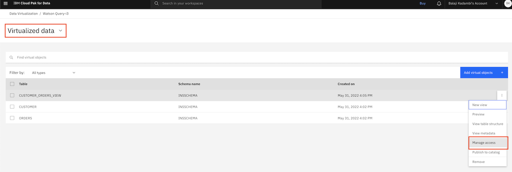
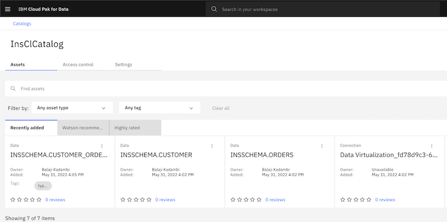

# Data Masking and Obfuscation for AI applications for Data Security & Privacy Conformance

Data Security & Privacy related laws and regulations have become more stringent and at the same time businesses are expected to open for ecosystem partners. This makes data governance very critical to avoid litigation, loss of competitive position and trust. 

Business transaction with sensitive information is exchanged within the enterprise, with customers, and ecosystem partners. Data such as name, location, contact details, date of birth, credit card number, financial details, not limited, needs to be handled with sensitivity. A data governance framework plays a critical role to enforce security and privacy at the same time be an enabler for business to achieve their strategy. 

There are multiple business scenarios wherein sensitive data needs to be captured or retrieved. Describing few important ones: 
- For customer support application, customer orders are being queried wherein customer mobile number, credit card number and location needs to be obscured or masked. 
- A machine learning application needs to perform an analysis based on sensitive information like credit card number. In such cases, the machine learning application needs to be provided obfuscated data for analysis and model building.

This code pattern demonstrates a methodology to provide a read-only view of data with senstive information masked for an application. 

For this purpose, an insurance business scenario has been taken. There are two applications provided:
- An insurance portal application
- A chatbot application


A customer registers on the insurance portal. During registration, the customer provides mobile number, address and e-mail. After registration, the customer can login and purchase insurance policies. The customer supplies credit card details for purchasing the policy. 
After an insurance policy has been purchased, a customer can query policy details with next premium due information on the chatbot. The user will be able to query this information without logging in. This requires sensitive information in the policy to be masked win the display. In this code pattern, the first 12 digits of the credit card used to purchase the policy will be masked and displayed with other details in the chatbot application.

The `Insurance Portal Application` owns the policy data. The `Chatbot Application` will have a read-only access of the data with `data protection policies` applied on the data specified in the `Data Governance` framework.

In this code pattern, you will learn how to:
- Set up data assets for governance in the Watson Knowledge Catalog
- Create data categories, classes, business terms and data protection rules for the data assets
- Create virtualized view of the data on Watson Query with data policies enforced
- Create a chatbot aapplication using Watson Assistant that consumes the read-only data with sensitive information masked from Watson Query

Security Verify has been used to implement authentication for the insurance application.


## Flow

1. Create tables in Db2. The Db2 connection and the tables(as `Data Asset`) are added to the `Watson Knowledge Catalog(WKC)`. The data policies are configured for the data assets in `WKC`.
2. Db2 is added as a data source in Watson Query. The needed tables are virtualized and a `View` is created by joining the virtualized tables. 
3. The Watson Query virtualized tables and view are published to `WKC`. The data policies are configured for the data assets in `WKC`.
4. User registers on the `Insurance Portal`. This creates an user profile on `Security Verify`. User logs into the `Insurance Portal` with the newly created credentials. 
5. The credentials are validated by `Security Verify` and request is re-directed to the application.
6. User purchases an `Insurance Policy`. The policy information is stored in the `Db2` database.
7. User accesses the chatbot on the `Insurance Portal` to query policy details.
8. The request is sent to `Watson Assistant`.
9. `Watson Assistant` invokes an API on the `Query App` to get policy details.
10. The `Query App` accesses the `Watson Query` with collaborator credentials. `Watson Query` returns the policy details data with data policies applied. The returned results are displayed on the chatbot to the user.

## Prerequisites
- [IBM Cloud account](https://cloud.ibm.com/)
- [IBM Cloud CLI](https://cloud.ibm.com/docs/cli?topic=cli-install-ibmcloud-cli)
- [Red Hat OpenShift instance](https://cloud.ibm.com/kubernetes/catalog/create?platformType=openshift)
- [Git client](https://git-scm.com/downloads)
- [The OpenShift CLI (oc)](https://cloud.ibm.com/docs/openshift?topic=openshift-openshift-cli)
- [Cloud Pak For Data](https://cloud.ibm.com/catalog/content/ibm-cp-datacore-6825cc5d-dbf8-4ba2-ad98-690e6f221701-global)
- [IBM Security Verify](https://www.ibm.com/security/digital-assets/iam/verify-demo-trial/)

## Steps
1. [Clone the repository](#1-clone-the-repository)
2. [Create IBM Cloud Services instances](#2-create-ibm-cloud-services-instances)
3. [Configure Security Verify](#3-configure-security-verify)
4. [Provide access for collaborators to Cloud Pak for Data](#4-provide-access-for-collaborators-to-cloud-pak-for-data)
5. [Set up and configure chatbot application](#5-set-up-and-configure-chatbot-application)
6. [Deploy Insurance Portal Application](#6-deploy-insurance-portal-application)
7. [Configure Watson Query](#7-configure-watson-query)
8. [Configure Watson Knowledge Studio](#8-configure-watson-knowledge-studio)
9. [Access the Application](#9-access-the-application)


### 1. Clone the repository

From a command terminal, run the below command to clone the repo:
```
git clone https://github.com/IBM/data-governance-mask-sensitive-data
```

### 2. Create IBM Cloud Services instances


#### 2.1 Create DB2, Watson Knowledge Catalog and Watson Query service instances on Cloud Pak for Data

In the code pattern, we will be using Cloud Pak for Data.

[Cloud Pak For Data](https://cloud.ibm.com/cloudpaks/data/overview) is available in two modes -
- [Fully-managed service](https://cloud.ibm.com/cloudpaks/data/overview) 
- [Self-managed software](https://cloud.ibm.com/catalog/content/ibm-cp-datacore-6825cc5d-dbf8-4ba2-ad98-690e6f221701-global)

##### 2.1.1 For fully managed service, click [here](CPDaaS.md) and follow the steps.

##### 2.1.2 For self managed software, click [here](CPD.md) and follow the steps.

##### 2.1.3 Create a catalog in Watson Knowledge Studio for Insurance Portal Application

Go to the Watson Knowledge Studio console. Select `View All Catalogs` on the hamburger menu on the top left.

Click on `Create Catalog`.


Enter a name for the catalog (say `InsClCatalog`). Enter a description. Select `Enforce data policies`. Click `Create`.


#### 2.2 Sign up for IBM Security Verify

Click [Security Verify](https://www.ibm.com/account/reg/signup?formid=urx-30041) to sign up for Security Verify. After you sign up for an account, the account URL (https://[tenant name].verify.ibm.com/ui/admin) and password is sent in an email.

#### 2.3 Create an OpenShift cluster to deploy applications

>Note: If you are using a Cloud Pak For Data as a self managed software, the same cluster can be used for application deployment.

Go to this [link](https://cloud.ibm.com/kubernetes/catalog/create?platformType=openshift) to create an instance of OpenShift cluster.

Make a note of the `Ingress Subdomain URL`:


### 3. Configure Security Verify

Please follow the instructions [here](SECURITY_VERIFY_CONFIG.md) to configure `Security Verify`.

### 4. Provide access for collaborators to Cloud Pak for Data

For fully managed service, click [here](CPDaaS_Access.md) and follow the steps.

For self managed software, click [here](CPD_Access.md) and follow the steps.

### 5. Set up and configure chatbot application

As detailed in architecture diagram, the chatbot uses Cloud Functions (or serverless functions) to call external APIs. So the chatbot side has three components aka the chatbot itself, Cloud functions to call external APIs and the application which hosts external APIs.

#### 5.1 Deploy REST application to access insurance details

We will deploy application that hosts external APIs to connect to Watson Query and read insurance details of users.
- From a terminal, login to your cluster using the oc login command
- Change directory to \<cloned repo parent folder\>/sources/chatbot/db-rest-app/src/main/resources.
- In a file editor open the file `env.props`.
- Replace `HOSTNAME`, `PORT` and `DB_NAME` with the host, port and database name that you noted during Watson Query creation in [this section](CPDaaS.md#51-note-down-watson-query-credentials) for fully managed service mode, and [here](CPD.md#2-note-down-credentials-for-db2-and-watson-query) for self managed software mode.
- For a fully managed Cloud Pak for Data service - as noted in [this section](CPDaaS_Access.md#3-create-ibm-cloud-api-key-in-data-collaborator-ibm-cloud-account), update value for API_KEY. After updating it should look like
```
HOSTNAME=xxxxxxx-xxxx-xxxx-xxxx-xxxxxxxx.xxxxxxxxxxxxxxxxxxx.databases.appdomain.cloud
PORT=XXXXX
API_KEY=xxxxxxxxxxxxxxxxxxxxxxxxxxxxxxxxxxxxxxxxxxxxxxxxxxxxxx
DB_NAME=XXXXX
```
> Note: If you are using the self managed cluster, enter the `user id` and `password` of the `Data Collaborator` user as the credentials for accessing the Watson Query. The database ODBC string must be changed to take username, password instead of API Key.

- Ensure you are in `governance` project. If not change to governance project `oc project governance`.
- Change directory to \<cloned repo parent folder\>/sources/chatbot/db-rest-app
- Run the following commands to deploy the application on to cluster
```
oc new-app . --name=dbconnection --strategy=docker
oc start-build dbconnection --from-dir=.
```
Monitor the logs using 
```
oc logs -f bc/dbconnection
```
This may take a few minutes. 

When done, check the status of pods. You may use `oc get pods` command.
Expose the application for it to be accessed
```
oc expose svc/dbconnection
oc get routes
```
Make a note of the `HOST`. It will be used in Cloud functions.


#### 5.2 Create Cloud Functions

- Login to IBM Cloud dashboard.
- In the Navigation Menu, click `Functions`->`Actions`.
- Click `Create` button.
- Click on `Action` tile.
- In `Action Name` text field, provide a name for the action such as `Make DB Calls`. Leave `Enclosing Package` as `Default Package` and `Runtime` as `Node.js 16`. Click `Create`.
- Replace the default code with the code provided in <Cloned repo parent folder>/chatbot/cloud-functions/Cloud Function.js.
- In the code, on line number 14, you will see that it requires hostname for the REST application that you deployed in [step 5.1](#51-deploy-rest-application-to-access-insurance-details). Replace the hostname with the route that was notes in [step 5.1](#51-deploy-rest-application-to-access-insurance-details).
- Click `Save`.
- Click `Endpoints` link on the left hand side of the screen.
- Under `Web Action` enable the checkbox `Enable as Web Action`. Click `Save`.
- Under `REST API`, make a note of the link with heading `URL`. We will need to use this for chatbot webhook settings.


#### 5.3 Configure Watson Assistant chatbot

- Click on the Watson Service instance link on your cloud resources and click `Launch Watson Assistant`.
- In the Watson Assistant home page, click `skills` option on the left menu options.
> If you do not see skills icon, then the Watson assistant view could be for the new experience UI. For this code pattern, we will use the classic view and hence switch to classic view by navigating to `manage` (user icon on top right corner) and clicking `Switch to classic experience`.
- Click `Create skill` button, then click `Dialog skill` tile. Click `Next`.
- Select `Upload skill` tab. Drag and drop or browse to select the file in <cloned repo>/sources/chatbot/chatbot resources/ecomm-skill-dialog.json. Click `Upload`.
- On the left navigation links click `Options`->`Webhooks` on the left hand navigation.
- In `URL` text field, enter the REST API endpoint as noted in section [5.2](#52-create-cloud-functions) and append it with .json. It should look something like this
```
https://eu-gb.functions.appdomain.cloud/api/v1/web/.../default/Make%20DB%20Calls.json
```
- Click `Assistants` icon on the top left corner of Watson Assistant screen
- Click `Create assistant`.
- Give a name for your assistant, optionally enter a description and click `Create assistant`.
- On the just created Assistant screen, click the `Preview` button. Make a note of `integrationID` and `serviceInstanceID` from the link provided under the section `Share this link`.
- Close the window using the `x` button placed just below the user icon on the top right corner.
- In Assistants page, under `Integrations` section (bottom right corner of the screen), click `Integrate web chat`.
- Click on `Create` button.
- Click on `Embed` tab. Copy and save the `script` in a text file. In this script, you will need to update `integrationID` and `serviceInstanceID` as noted from Preview link earlier.
- This code snippet will be used in the Insurnace Portal UI.

### 6. Deploy Insurance Portal Application
**Login to your OpenShift cluster from command line**

Login to your OpenShift cluster. Access the `IBM Cloud Dashboard > Clusters (under Resource Summary) > click on your OpenShift Cluster > OpenShift web Console`. Click the dropdown next to your username at the top of the OpenShift web console and select Copy Login Command. Select Display Token and copy the oc login command from the web console and paste it into the terminal on your workstation. Run the command to login to the cluster using `oc` command line.

#### 6.1 Configure Insurance Portal Service

**6.1.1 Changes to server.xml**

In the cloned repo folder - go to `src/main/liberty/config`. Open `server.xml`.

Make the below changes for the `openidConnectClient` element and save the file:
- Replace {{ingress-sub-domain}} with `Ingress subdomain` of the OpenShift cluster.
- Replace {{clientId}} and {{clientSecret}} with the Client ID and Client secret noted on the `Sign-on` tab of Security Verify.
- Replace {{tenantId}} with the tenant id of Security Verify noted at the time of creation.

```
<openidConnectClient id="home"
		signatureAlgorithm="RS256"
		httpsRequired="false"    
		redirectToRPHostAndPort="http://ins-portal-app-governance.{{ingress-sub-domain}}/insportal/app"
		clientId="{{clientId}}"
		clientSecret="{{clientSecret}}"
		authorizationEndpointUrl="https://{{tenantId}}.verify.ibm.com/v1.0/endpoint/default/authorize"
		tokenEndpointUrl="https://{{tenantId}}.verify.ibm.com/v1.0/endpoint/default/token"></openidConnectClient>
```

**6.1.2 Changes to db.config**

In the cloned repo folder - go to `src/main/resources`. Open `db.config`.

Replace the {{host}} and {{port}} with the host and port you noted during Db2 credentials creation. Enter the userid, password and schema with the username, password and username(in uppercase). Save the file.
> Note: the schema should be in uppercase of the username noted in Db2 credentials.
```
jdbcurl=jdbc:db2://{{host}}:{{port}}/bludb:sslConnection=true;
userid=
password=
schema=
```

**6.1.3 Changes to verify.config**
In the cloned repo folder - go to `src/main/resources`. Open `verify.config`.

Make the below changes and save the file:
- Replace {{tenant-id}} with the tenant id of Security Verify noted at the time of creation.
- For `clientId` and `clientSecret` enter the Client ID and Client secret noted on the `Sign-on` tab of Security Verify.
- For `apiClientId` and `apiClientSecret` enter the Client ID and Client secret noted on the `API Access` tab of Security Verify.

```
introspectionUrl=https://{{tenant-id}}.verify.ibm.com/v1.0/endpoint/default/introspect
tokenUrl=https://{{tenant-id}}.verify.ibm.com/v1.0/endpoint/default/token
userInfoUrl=https://{{tenant-id}}.verify.ibm.com/v1.0/endpoint/default/userinfo
clientId=
clientSecret=
usersUrl=https://{{tenant-id}}.verify.ibm.com/v2.0/Users
apiClientId=
apiClientSecret=
```

#### 6.2 Deploy Insurance Portal Service
On the terminal window, got to the repository folder that we cloned earlier and change directory to `/sources/ins-portal-app`. 

Run the following commands to deploy `Insurance Portal application`.
```
oc new-project governance
mvn clean install
oc new-app . --name=ins-portal-app --strategy=docker
oc start-build ins-portal-app --from-dir=.
oc logs -f bc/ins-portal-app
oc expose svc/ins-portal-app
```
Ensure that the application is started successfully using the command `oc get pods`. Also make a note of the route using the command `oc get routes`. 

#### 6.3 Configure Db2 database

In this step, we will create two tables in the Db2 database - CUSTOMER and ORDERS table.

Invoke the URL - http://ins-portal-app-governance.{{IngressSubdomainURL}}/insportal/app/setupdb

>Note: Replace {{IngressSubdomainURL}} with `Ingress subdomain` of the OpenShift cluster.

### 7. Configure Watson Query

Login to `Cloud Pak for Data` with `Data Owner` credentials. Go to the Watson Query console.

#### 7.1 Enforce data policies

Select `Service settings` in the dropdown menu. Click on `Governance` tab. Enable `Enforce policies within Data Virtualization` and `Enforce publishing to a governed catalog`.


#### 7.2 Add Db2 connection 

Select `Data Sources` in the dropdown menu. Click on `Add Connection`.  Select `Db2 on Cloud` if the instance is on IBM Cloud. Enter the `Db2` credentials that you noted earlier, and create the connection.


#### 7.3 Create schema

Select `Schemas` in the dropdown menu. Click on `New schema` with a name say `INSSCHEMA`.


#### 7.4 Virtualize CUSTOMER and ORDERS tables

Select `Schemas` in the dropdown menu. Select the `CUSTOMER` and `ORDER` tables. Add to Cart. Go to the cart, select `Virtualized data` option and click on `Virtualize` as shown.


#### 7.5 Create a CUSTOMER_ORDERS_VIEW

Select `Virtualized data`  in the dropdown menu. Select `CUSTOMER` and `ORDERS` table. Click on `Join`. In the next page, create a joiin key from `CUST_ID` of `CUSTOMER` table to `CUST_ID` of `ORDERS` table.


On the next page, select `Virtualized data` option. Click `Create View`.


#### 7.6 Provide user access to `Data Collaborator`

Select `Virtualized data`  in the dropdown menu. For the `CUSTOMER_ORDERS_VIEW` select `Manage Access`. On the access page, click on `Grant Access` and provide access to the `Data Collaborator` user.



### 8. Configure Watson Knowledge Studio

Login to `Cloud Pak for Data` with `Data Owner` credentials. Go to the Watson Query console.

#### 8.1 View the catalog and data assets
	
Click `View All Catalogs` on the left hamburger menu. Click on the catalog that you created earlier. All the Watson Query Data Assets should appear as shown.



Click on the `INSSCHEMA.CUSTOMER` data asset. Click on the `Asset` tab. 
	
Enter the connection details of Watson Query noted earlier.
	
If it is a fully managed Cloud Pak for Data service:
- On the IBM Cloud Dashboard, go to `Manage` and select `Access (IAM`). Create an IBM Cloud API Key. Note the API key.
- On the `Asset` tab, select API Key as the mode of authentication.
- Enter the API key noted in the earlier step, and click `Connect`.

If it is a self managed software for Cloud Pak for Data:
- Enter the `Data Owner` credentials for Cloud Pak for Data.

The data should now be visible on the `Asset` tab:

	
#### 8.1.1 Create a data profile
	
For each of the assets - `INSSCHEMA.CUSTOMER`,`INSSCHEMA.ORDERS` and `INSSCHEMA.CUSTOMER_ORDERS_VIEW`, go to the `Profile` tab and click `Create Profile`.


	
#### 8.2 Create a category

Click `View All Catalogs` on the left hamburger menu. Click on `Add category` and select `New category`.


	
Create a category for personal financial information. Enter a `name` and click `Create`.
	
#### 8.3 Create a data class

Click `Data classes` on the left hamburger menu. Click on `Add data class` and select `New data class`.	

Enter details as shown and click `Create`.

	

This will be saved as `Draft`. Click `Publish` to publish the data class.


	
#### 8.3 Create a business term

Click `Business terms` on the left hamburger menu. Click on `Add business term` and select `New business term`.	

Enter details as shown and click `Create`.


	
This will be saved as `Draft`. Click `Publish` to publish the business term.

#### 8.4 Create a data protection rule

Click `Rules` on the left hamburger menu. Click on `Add rule` and select `New rule`.	
Next select `Data protection rule`. Configure the rule as shown. This rule will mask the credit card data for collaborators.


	
### 9. Access the application

>Note: Please specify a valid email on the `Registration` page. `Security Verify` will send the initial password to the specified email address after registration. 
	

