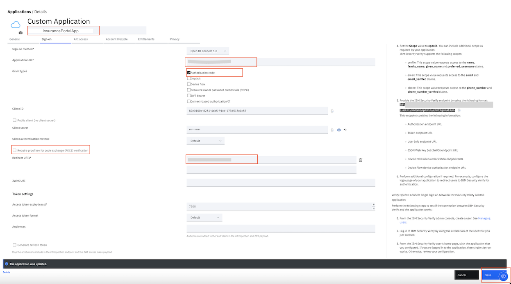
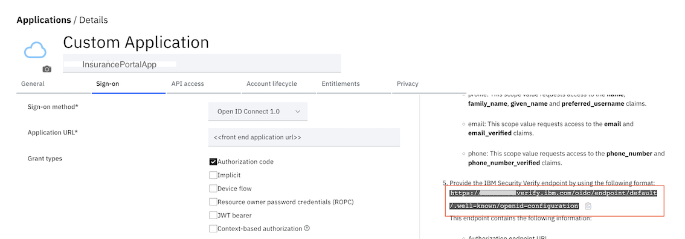
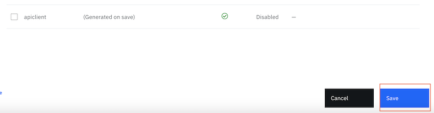
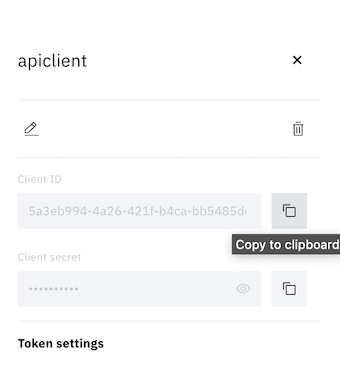

#### 3.2 Configure Security Verify

Please keep the `Ingress subdomain URL` of the OpenShift cluster ready. We will need it to configure the Security Verify.

**Add a custom application**
- Login to Security Verify. Use the URL for your admin account that was sent to you in the confirmation email: https://[tenant name].verify.ibm.com/ui/admin.
- Select Applications from the menu on the left.
- To add an application, click Add application.
- Select Custom Application as the application type, then click Add application.
- Specify a name for the application. Then, on the General tab, specify a company name.
- Click the Sign-on tab. Configure SSO using the OpenID Connect based authentication with Authorization code scheme. Specify these values:
  - For the Sign-on method, select Open ID Connect 1.0.
  - For the Application URL, enter the URL as http://ins-portal-app-governance.{{`Ingress subdomain URL`}}. Replace {{`Ingress subdomain URL`}} with the `Ingress subdomain URL` of the OpenShift cluster. 
  - For the Grant types, check Authorization code.
  - Uncheck Require proof key for code exchange (PKCE) verification.
  - For Redirect URIs, enter the re-direct URL as http://ins-portal-app-governance.{{`Ingress subdomain URL`}}/insportal/app/oidcclient/redirect/home. Replace {{`Ingress subdomain URL`}} with the `Ingress subdomain URL` of the OpenShift cluster.
  - Click Save to save this SSO configuration.

- Click the Entitlements tab. For the Access Type, select Automatic access for all users and groups. Click Save to save the custom application.
- Click the Sign-on tab. Note down the **client ID and the client secret**. This is needed for configuring the `Insurance Portal application`.

**Note Security Verify endpoints**
In the far right information pane, note down the IBM Security Verify endpoint.

.

Then, note down the following endpoints: **authorization_endpoint, token_endpoint and introspection_endpoint**. These will be needed to configure our `Insurance Portal` application to integrate with Security Verify.

**Add an API Client**
- Click on the `API Access` tab on application settings
- Click on `Add API Client` button
- Enter a name and click on `Save`
- Again click `Save` on the parent settings page. The credentials will now be generated.

- Select the added `API Client`. On the right pane, the generated credentials can be copied. Make a note of the credentials. They will be needed for the `Insurance Portal application` configuration. Also note that this is different from the `client-id` and `client-secret` we noted when you created the SSO configuration. 

Back to main [README.md](README.md) page.

